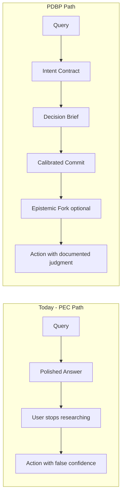
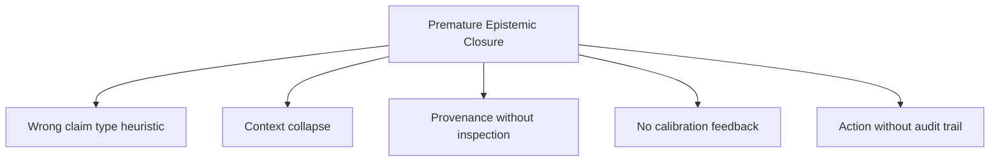
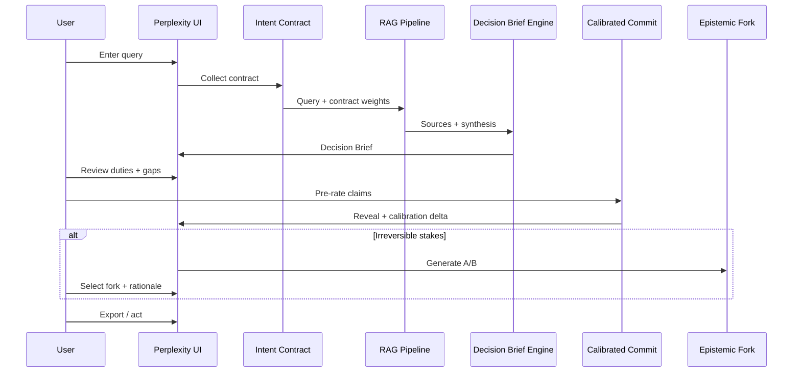
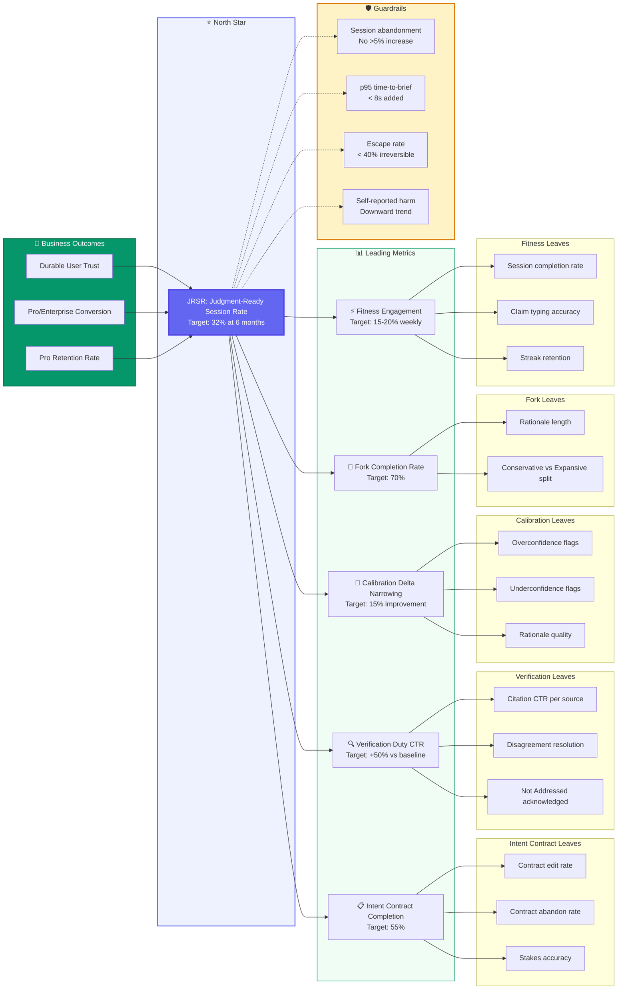

# Perplexity Decision Brief Protocol (PDBP)

**Growth Team Product Architecture**  
**Product:** Perplexity AI  
**Version:** 3.0  
**Date:** May 2026  
**Status:** Proposed Solution (Award-Grade)

---

## Executive Summary

Perplexity wins on **provenance visibility** (21.87 citations/response, inline attribution, 780M monthly queries). It loses on **decision readiness**: users leave sessions feeling research-complete when they are only narrative-satisfied.

The root failure is not missing fact-checks. It is **Premature Epistemic Closure (PEC)**: Perplexity's answer format optimizes for a single polished synthesis that signals "you can stop investigating now," even when evidence is thin, inferential, or misaligned with the user's actual decision.

**Perplexity Decision Brief Protocol (PDBP)** reframes the product outcome from *answer delivery* to *judgment-ready decision support*. It combines three mechanisms no competitor ships together:

1. **Intent Contract** before retrieval (what decision, what "good enough" means)  
2. **Decision Brief** instead of essay answers (sourced facts / inferences / unknowns / your verification duties)  
3. **Calibrated Commit Gate** before action (you score key claims first, then compare to evidence structure)  
4. **Epistemic Fork** on high-stakes queries (two defensible readings from the same sources; you choose and document why)

PDBP does not assign trust scores, replace human judgment, or hide behind a second AI verifier. It changes the **interaction ritual** so users build durable evaluation skill while Perplexity owns the research workflow end-to-end.

---

## Table of Contents

1. [Market Landscape](#1-market-landscape)
2. [Business Outcomes](#2-business-outcomes)
3. [User Journey](#3-user-journey)
4. [Target Segment](#4-target-segment)
5. [User Research](#5-user-research)
6. [Root Problem Analysis](#6-root-problem-analysis)
7. [Five Solution Directions](#7-five-solution-directions)
8. [Chosen Solution: PDBP](#8-chosen-solution-pdbp)
9. [Metrics](#9-metrics)
10. [Why PDBP Might Fail](#10-why-pdbp-might-fail)
11. [Technical Architecture & Demo](#11-technical-architecture--demo)

---

## 1. Market Landscape

### 1.1 How Users Evaluate AI Search Today

| Behavior | Prevalence (our research) | Why it fails |
|----------|---------------------------|--------------|
| Skim citations, rarely open | 80% (4/5) | Visibility without verification |
| Trust fluency + citation count | Universal heuristic | Citation Illusion (density ≠ accuracy) |
| Cannot separate fact vs inference | 60% struggle | Wrong heuristic applied to all claims |
| Unpredictable trust | 60% | No calibration feedback loop |
| Act on weak outputs | 60% harmed | PEC: stop too early |

**Tow Center (2025):** Perplexity incorrect on 37% of systematic news-attribution tests; Pro tier more definitive and *more* wrong, not less. **Qwairy (2026):** 21.87 citations/response vs ChatGPT 7.92: more provenance surface, not more judgment support.

### 1.2 Why Existing Mechanisms Fail

| Approach | What it optimizes | Why trust problem persists |
|----------|-------------------|----------------------------|
| Citations | Provenance | Users don't click; misattribution still possible |
| Trust scores | Speed of decision | Black-box authority; REL-A.I. shows scores don't predict reliance |
| Fact-check bots | Binary correctness | Ignores inference, usefulness, context; AI judging AI |
| Reasoning traces | Transparency theater | Post-hoc narrative, not ground truth |
| Explainability panels | Information volume | Cognitive overload without behavior change |

**Gap:** No product ties output format to *user decision context* and *calibration training*.

### 1.3 The Quality Perception Gap

The trust problem persists because of a structural mismatch between **actual output quality** and **perceived output quality**. Current AI search products are unintentionally designed to maximize perceived quality while leaving actual quality uninspected.

| Quality Dimension | Actual State | What User Perceives | Structural Cause |
|---|---|---|---|
| Correctness | 37% error rate (Tow Center) | "21 citations = well-researched" | Citation density signals diligence |
| Completeness | Critical gaps unmentioned | "Covers everything I need" | Polished prose creates illusion of completeness |
| Reasoning | Inferences = same voice as facts | "All claims equally reliable" | No visual/structural distinction between claim types |
| Usefulness | Generic, not decision-tailored | "Great answer" | Users judge quality abstractly, not against their decision |
| Uncertainty | Source conflicts silently collapsed | "Sources agree" | Single-narrative synthesis hides disagreements |

**Key finding:** Pro tier *widens* this gap. Tow Center showed Pro is more definitive when wrong — the users paying for rigor get higher perceived quality and lower actual quality.

**PDBP directly closes each dimension of this gap:**
- Intent Contract → usefulness gap (defines what "good" means for this user)
- Decision Brief → correctness + reasoning gaps (separates fact from inference)
- Epistemic Fork → uncertainty gap (surfaces multiple valid readings)
- Calibrated Commit → *measures* the gap per-claim (confidence rating vs. evidence strength)
- Research Debt → completeness gap (makes missing work visible)

---

## 2. Business Outcomes

### 2.1 Strategic Thesis

Perplexity's next moat is not more citations. It is becoming the system professionals use when **stakes are high and judgment must stay human**.

| Outcome | PDBP mechanism |
|---------|----------------|
| Durable trust | Appropriate reliance, fewer "AI betrayed me" moments |
| Pro / Enterprise conversion | Decision Brief mode as Pro differentiator |
| Session depth | Intent Contract + Commit Gate increase engaged time quality |
| Liability posture | Explicit "your verification duties" reduces blind reliance |

### 2.2 North Star Metric

**Judgment-Ready Session Rate (JRSR):** % of Pro sessions where user (a) completes Intent Contract, (b) reviews Decision Brief sections through "Your verification duties," and (c) completes Calibrated Commit on ≥3 claims before export/share/external action.

**Target:** 32% at 6 months (vs. baseline 0% today).

### 2.3 Trade-offs

| Tension | PDBP resolution |
|---------|-----------------|
| Speed vs accuracy | Brief mode default; full essay optional |
| Assistance vs dependence | System never verdicts; user commits in writing |
| Transparency vs overload | Brief sections progressive; Fork only high-stakes |
| Trust vs engagement | Shorter answers possible; higher decision quality |

---

## 3. User Journey



### 3.1 Customer Journey Map

| Stage | User Actions | Emotions / Thoughts | Pain Points (Current State) | PDBP Intervention |
|-------|--------------|---------------------|-----------------------------|-------------------|
| **1. Intent** | User faces a high-stakes decision and formulates a query. | *Anxious but hopeful.* "I need the right answer quickly so I can move forward." | Unstated stakes. User treats a board-level query the same as a trivia search. | **Intent Contract (15s)** forces the user to articulate the decision, stakes, and what "good enough" looks like. |
| **2. Prompting & Retrieval** | User submits the query and waits for the AI to synthesize information. | *Passive.* Expecting the system to do the heavy lifting of evaluating sources. | Generic retrieval optimizes for general summaries, not the user's specific context. | **Contract-weighted retrieval** uses the Intent Contract to filter for relevance to the user's specific decision. |
| **3. Output & Review** | User reads the generated response and glances at citation badges. | *Satisfied.* "This looks polished and authoritative. It has 20 citations." | **Premature Epistemic Closure.** The essay format hides gaps and unverified inferences behind fluent prose. | **Decision Brief** resists closure. Splits claims into Sourced vs Inferred, lists "Not Addressed", and ranks Verification Duties. |
| **4. Evaluation** | User decides whether to trust the response enough to act on it. | *Overconfident.* "The AI said it clearly, so it must be right." | Gut feel replaces critical evaluation. No feedback loop for trust calibration. | **Calibrated Commit** forces users to rate their confidence on key claims *before* seeing the evidence structure, revealing their calibration delta. |
| **5. Action** | User copies the response into a memo, email, or presentation. | *Relieved.* "Done. I have what I need to make the decision." | No audit trail of why the user trusted the output. Action taken on unverified inferences. | **Epistemic Fork** (for irreversible stakes) requires selecting between two defensible readings and documenting the rationale before export. |
---

## 4. Target Segment

**Primary:** Power knowledge workers using Perplexity 2+/day for research synthesis, competitive analysis, policy/financial/medical information, and career decisions.

**Excluded:** Casual curiosity search; users wanting one-click answers without reflection.

**Unmet needs (from research):**

- Know what was **excluded**, not just included (60% top request)  
- See **unstated assumptions** (40%)  
- Separate **sourced vs inferred** (20%, but 60% struggle in practice)  
- **Stress-test** before acting (Devil's Advocate appeal 60%)  
- **Not repeat flagged errors** in same thread (Vikas)  
- **Know when AI is unsure** in code/technical domains (Srivatsan)

---

## 5. User Research

**Methods:** Survey n=5 (preliminary, directional); 6-8 interviews planned; 2+ task observations planned. Ethics: consent, anonymization, no sensitive prompts stored.

### Synthesized Insights

| ID | Finding | PDBP component |
|----|---------|----------------|
| R1 | 80% skim citations, rarely open | Verification duties ranked by leverage |
| R2 | 60% can't separate fact/inference | Brief sections: Sourced / Inferred / Unknown |
| R3 | 60% unpredictable trust | Calibrated Commit builds feedback loop |
| R4 | 60% want excluded perspectives | "Not addressed for your decision" section |
| R5 | Flagged errors recur in thread | Session memory on disputed claims |
| R6 | Overconfidence in technical outputs | Linguistic confidence vs evidence mismatch callout |

---

## 6. Root Problem Analysis

### 6.1 Beyond Citation Illusion: Premature Epistemic Closure

**Citation Illusion** is a symptom. **PEC** is the disease:

> Perplexity delivers a single authoritative narrative so fluently that users experience *epistemic closure* (the feeling that inquiry is complete) before they have performed the verification appropriate to their stakes.

**Why Perplexity is uniquely exposed:**

1. **Synthesis-as-answer:** RAG compresses heterogeneous sources into one voice. Users cannot see the multiplicity they should respect.  
2. **Citation theater:** 21 badges suggest diligence completed on user's behalf.  
3. **Pro definitiveness:** Tow Center shows Pro answers wrong more confidently.  
4. **No decision object:** Output is optimized for reading, not for "what do I do Monday morning?"

### 6.2 The Five Judgment Failures



| Failure | Description |
|---------|-------------|
| **J1** | Treating inferences like facts because they share the same prose style |
| **J2** | "Good answer" judged without reference to user's decision criteria |
| **J3** | Citations present but evidentiary chain not walked |
| **J4** | Confidence feeling never compared to outcome |
| **J5** | No record of why user trusted output when harm occurs |

PDBP targets all five systematically.

---

## 7. Five Solution Directions

Each direction was scored on: user insight fit (25%), judgment development (25%), trust ethics (20%), Perplexity differentiation (15%), feasibility (15%). Scale 1-5.

---

### Solution 1: Unified Trust & Veracity Score

**Concept:** Single 0-100 score per answer from source quality, model entropy, and verifier agreement.

| Dimension | Score | Rationale |
|-----------|-------|-----------|
| User insight | 2 | Users asked for structure, not a number |
| Judgment development | 1 | Outsources judgment to score |
| Trust ethics | 1 | False precision; new authority to over-trust |
| Differentiation | 2 | Commodity; liability if wrong |
| Feasibility | 5 | Easy to build |
| **Total (weighted)** | **1.75** | |

**Verdict: REJECTED.** Violates brief. REL-A.I. (NAACL 2025): calibration ≠ human reliance.

---

### Solution 2: Autonomous Fact-Verification Agent

**Concept:** Second AI pass labels each sentence Supported / Unsupported / Unknown.

| Dimension | Score | Rationale |
|-----------|-------|-----------|
| User insight | 3 | Helps facts only |
| Judgment development | 2 | User learns to trust verifier |
| Trust ethics | 2 | AI-on-AI black box |
| Differentiation | 3 | Some competitors exploring |
| Feasibility | 3 | Cost + latency at 780M queries/mo |
| **Total (weighted)** | **2.55** | |

**Verdict: REJECTED.** "Fact-checking alone" fails brief. Ignores inference, normative claims, completeness.

---

### Solution 3: Passive Judgment Sidebar (ContextLens-class)

**Concept:** Essay answer unchanged; side panel shows claim types, assumptions, gaps, Devil's Advocate.

| Dimension | Score | Rationale |
|-----------|-------|-----------|
| User insight | 4 | Maps to survey requests |
| Judgment development | 3 | Optional sidebar = low engagement |
| Trust ethics | 4 | No verdicts if well-designed |
| Differentiation | 4 | Better than scores |
| Feasibility | 5 | Async metadata |
| **Total (weighted)** | **3.85** | |

**Verdict: REJECTED as primary solution.** Bolt-on metadata does not break PEC: user still reads closure-inducing essay first; 80% never open side panels. **Innovation ceiling too low for award-grade work.**

---

### Solution 4: Intent Contract Research (ICR)

**Concept:** Before retrieval, user completes micro-contract: decision type, deadline, success criteria, stakes. Answer rendered as **fulfillment matrix** against contract, not generic prose.

**Example contract fields:**
- "I am deciding whether to..."  
- "I need this by..."  
- "Good enough means..."  
- "Stakes: exploratory / operational / irreversible"

**Answer shape:**
| Contract criterion | Evidence status | Sources |
|------------------|-----------------|---------|
| Market size for 2026 | Partially met | [1][3] |
| Regulatory risk | Not addressed | — |

| Dimension | Score | Rationale |
|-----------|-------|-----------|
| User insight | 5 | Fixes context collapse (J2) |
| Judgment development | 4 | User defines "good" |
| Trust ethics | 5 | No score; explicit gaps |
| Differentiation | 5 | No AI search product does this |
| Feasibility | 4 | UX friction risk |
| **Total (weighted)** | **4.65** | |

**Verdict: STRONG.** Core pillar of PDBP.

---

### Solution 5: Epistemic Fork Studio (EFS)

**Concept:** For high-stakes queries, Perplexity generates **two defensible syntheses** from the **same** source set:

- **Fork A (Conservative):** Emphasizes uncertainty, conflicts, oldest corroborated claims  
- **Fork B (Expansive):** Emphasizes opportunity, convergent trends, forward projections  

User must **select a fork** and write one sentence: "I choose Fork A because..." before copy/export. No "correct" fork.

| Dimension | Score | Rationale |
|-----------|-------|-----------|
| User insight | 4 | Surfaces multiplicity hidden by single narrative |
| Judgment development | 5 | Forces explicit frame commitment |
| Trust ethics | 5 | Anti-closure by design |
| Differentiation | 5 | Novel in consumer AI search |
| Feasibility | 3 | 2x synthesis cost on subset of queries |
| **Total (weighted)** | **4.45** | |

**Verdict: STRONG.** PDBP high-stakes module.

---

### Solution 6: Calibrated Commit Protocol (CCP)

**Concept:** Before seeing epistemic decomposition, user rates confidence (1-5) on 3-5 key claims extracted from draft answer (shown without source labels). System reveals structure; user sees **calibration delta** (over/under confidence patterns). Optional monthly private digest (opt-in).

Inspired by meteorological calibration training and MetaFaith (EMNLP 2025) on faithful uncertainty expression.

| Dimension | Score | Rationale |
|-----------|-------|-----------|
| User insight | 4 | Addresses unpredictable trust (60%) |
| Judgment development | 5 | Only direction that trains skill measurably |
| Trust ethics | 4 | Privacy-sensitive; must be opt-in digest |
| Differentiation | 5 | No search competitor does pre-commit |
| Feasibility | 4 | Extra step; needs careful UX |
| **Total (weighted)** | **4.55** | |

**Verdict: STRONG.** PDBP gate before action.

---

### 7.1 Comparative Matrix (All Five Explored Directions)

| Criterion (weight) | Sol 1 Score | Sol 2 Fact | Sol 3 Sidebar | Sol 4 ICR | Sol 5 Fork | Sol 6 CCP |
|--------------------|-------------|------------|---------------|-----------|------------|-----------|
| User insight (25%) | 1.75 | 2.55 | 3.85 | **4.65** | 4.45 | 4.55 |
| Judgment dev (25%) | 1.00 | 2.00 | 3.00 | 4.00 | **5.00** | **5.00** |
| Trust ethics (20%) | 1.00 | 2.00 | 4.00 | **5.00** | **5.00** | 4.00 |
| Differentiation (15%) | 2.00 | 3.00 | 4.00 | **5.00** | **5.00** | **5.00** |
| Feasibility (15%) | **5.00** | 3.00 | **5.00** | 4.00 | 3.00 | 4.00 |
| **Weighted total** | **1.75** | **2.55** | **3.85** | **4.65** | **4.45** | **4.55** |

### 7.2 Strategic Synthesis Decision

**No single direction wins alone.** Award-grade solution requires changing the **primary answer artifact**, not annotating it.

**Selected approach: Perplexity Decision Brief Protocol (PDBP)** = ICR + CCP + EFS (high-stakes) + rejection of sidebar-only design.

| Pillar | Source solution | Role in PDBP |
|--------|-----------------|--------------|
| Intent Contract | ICR | Before retrieval |
| Decision Brief | ICR (format) | Replaces closure-inducing essay |
| Calibrated Commit | CCP | Before export/action |
| Epistemic Fork | EFS | High-stakes only |
| ~~Trust score~~ | Sol 1 | Excluded |
| ~~Fact bot~~ | Sol 2 | Excluded |
| ~~Sidebar-only~~ | Sol 3 | Excluded as primary |

---

## 8. Chosen Solution: PDBP

### 8.1 Product Principles

1. **Decision readiness over answer completeness.**  
2. **User is the judge; system is the clerk.** (structures evidence, never verdicts)  
3. **Closure is earned, not given.** (Commit Gate required for high-stakes export)  
4. **Same sources, multiple honest readings.** (Fork, not hallucinated counters)  
5. **Inspectable chains.** (Every inferred claim links to snippets)

### 8.2 The Four PDBP Modules

#### Module A: Intent Contract (pre-retrieval)

15-second flow triggered on Pro / detected high-stakes:

```
What decision does this research support?  [text]
Stakes level?  [Exploratory | Operational | Irreversible]
What would "good enough" look like?  [text]
By when do you need to act?  [date optional]
```

Contract is shown pinned above brief. Retrieval reranks toward contract criteria.

#### Module B: Decision Brief (primary output)

Replaces essay as default Pro format:

| Section | Content | Anti-PEC function |
|---------|---------|-------------------|
| **Sourced findings** | Claims with inline [n]; only direct support | Separates ground truth layer |
| **Inferred conclusions** | Logic chain explicit; linked sources | Surfaces synthesis risk |
| **Not retrieved / not addressed** | Gaps vs Intent Contract | Blocks false completeness |
| **Your verification duties** | Ranked actions for *this user* | Converts skim to inspect |
| **Source disagreement map** | Where sources conflict; no resolution | Preserves ambiguity |

Optional: "Show narrative summary" collapses brief into prose for low-stakes.

#### Module C: Calibrated Commit Gate (pre-action)

1. System shows 3-5 claim cards (no type labels, no sources)  
2. User rates trust 1-5 per claim  
3. Reveal: types, sources, mismatch alerts ("You rated 5/5; single weak source")  
4. User edits commitment or returns to brief  
5. Export/share blocked on irreversible stakes until complete (override with warning)

#### Module D: Epistemic Fork (irreversible stakes)

- **Fork Conservative** and **Fork Expansive** side-by-side  
- Same citation pool; difference is weighting and framing  
- User selects + mandatory rationale sentence  
- Stored in session for audit

### 8.3 System Flow



### 8.4 Edge Cases

| Case | Behavior |
|------|----------|
| Conflicting sources | Disagreement map; no winner picked |
| Thin retrieval | "Not retrieved" dominates; narrative disabled |
| User skips contract | Brief still generates; gaps section notes "no contract" |
| Overconfident prose | Mismatch alert on Commit reveal |
| Repeat flagged claim | Session highlights; blocks auto-reuse in synthesis |
| User wants speed | "Quick answer" escapes to legacy essay with banner |

### 8.5 Why PDBP Beats ContextLens-Class Sidebars

| ContextLens weakness | PDBP fix |
|---------------------|----------|
| Essay induces closure first | Brief resists closure by structure |
| Optional panel | Commit Gate on critical path |
| Metadata after the fact | Intent shapes retrieval |
| Single narrative | Fork on high-stakes |
| Teaches labels, not decisions | Contract + commit + rationale |

---

## 9. Metrics

### 9.1 KPI Tree

The KPI tree shows how individual feature metrics (leaves) flow upward into the North Star metric (JRSR), which in turn drives business outcomes. Guardrails prevent us from optimizing the wrong thing.



### 9.2 Metric Definitions

| Type | Metric | Definition | 6-mo Target |
|------|--------|------------|-------------|
| **North Star** | Judgment-Ready Session Rate (JRSR) | % of Pro sessions where user completes Intent Contract + reviews verification duties + completes Calibrated Commit on ≥3 claims before export/share/external action | 32% |
| **Leading** | Intent Contract completion rate | % of Pro high-stakes sessions where user submits a contract (not skipped or abandoned) | 55% |
| **Leading** | Verification duty click-through | % of listed verification duties where user clicks at least one related citation | +50% vs citation CTR baseline |
| **Leading** | Calibration delta narrowing | Average reduction in |user confidence rating − evidence strength| for repeat users over 4 weeks | 15% improvement |
| **Leading** | Fork completion rate | % of irreversible-stakes sessions where user selects a fork and writes rationale | 70% |
| **Leading** | Epistemic Fitness engagement | % of Pro users completing ≥1 fitness session per week after first month | 15-20% |
| **Guardrail** | p95 time-to-brief | 95th percentile latency added by Decision Brief vs legacy essay | <8s added |
| **Guardrail** | Session abandonment | % of sessions abandoned after Intent Contract or Brief loads | No >5% increase |
| **Guardrail** | Quick-answer escape rate | % of irreversible-stakes sessions where user clicks "Show legacy essay" | <40% |
| **Guardrail** | Self-reported harm | User-reported incidents where AI output led to poor decisions | Downward trend |

### 9.3 How Each PDBP Solution Moves the KPI Tree

| Solution | Primary Metric It Moves | Secondary Metrics | Guardrail It Risks |
|----------|------------------------|-------------------|-------------------|
| **Intent Contract** | IC completion rate → JRSR | Stakes accuracy, Contract edit rate | Session abandonment (friction) |
| **Decision Brief** | Verification duty CTR → JRSR | Citation click-through, Not Addressed acknowledgment | Time-to-brief (latency) |
| **Epistemic Fork** | Fork completion rate → JRSR | Rationale quality, Conservative/Expansive split | Quick-answer escape (friction) |
| **Calibrated Commit** | Calibration delta narrowing → JRSR | Over/underconfidence flags, Rationale quality | Session abandonment (extra step) |
| **Research Debt** | Verification duty CTR → JRSR | Source disagreement resolution, Citation CTR | — (passive meter, low risk) |
| **Epistemic Fitness** | Fitness engagement → long-term JRSR | Claim typing accuracy, Streak retention | Engagement drop after novelty |

### 9.4 Experiment Plan

| Phase | Scope | Duration | Success Criteria to Proceed |
|-------|-------|----------|---------------------------|
| **Phase 1: Dogfood** | Internal team (n=10) | 2 weeks | No critical UX blockers; >60% contract completion |
| **Phase 2: Alpha** | 5% of Pro users (random) | 4 weeks | JRSR ≥15%; abandonment <5% increase |
| **Phase 3: Beta** | 25% of Pro users | 6 weeks | JRSR ≥25%; calibration delta narrowing ≥10% |
| **Phase 4: GA** | All Pro users (essay mode available as toggle) | Ongoing | JRSR ≥32%; Pro conversion lift ≥5% |

Qualitative cohort: n=20 structured interviews at Phase 2 and Phase 3 transitions, focused on decision quality and perceived friction.

**Experiment plan:** 5% Pro A/B → 25% → GA. Qualitative cohort n=20 for decision quality interviews.

---

## 10. Target User Personas

Based on our research (survey n=5, desk research, behavioral patterns), we define three primary personas:

### Persona 1: Priya — The Regulatory Lead

| Attribute | Detail |
|-----------|--------|
| **Role** | Regulatory Affairs Lead, MedTech startup (Series B) |
| **Stakes** | Irreversible — her FDA filing decision affects the company's 18-month runway |
| **Behavior** | Uses Perplexity Pro 3x/day for regulatory research; trusts citation density as quality proxy |
| **Pain point** | "I cited a Perplexity response in a regulatory memo. Six months later we discovered the PCCP guidance was draft, not final. Nobody flagged that." |
| **What she needs** | Explicit claim typing (fact vs. inference vs. draft), forced verification duties before she can share externally, and a record of what she trusted and why |
| **PDBP match** | Full 5-phase protocol: Intent Contract → Decision Brief → Epistemic Fork → Calibrated Commit → Research Debt |

### Persona 2: Raj — The Strategy Analyst

| Attribute | Detail |
|-----------|--------|
| **Role** | Strategy Analyst, Enterprise SaaS company |
| **Stakes** | Operational — his market sizing feeds board presentations and budget decisions |
| **Behavior** | Searches 5-8 queries per research session; copies responses into Google Docs; rarely inspects individual sources |
| **Pain point** | "I put '$28.4B market size' in a board deck. My VP asked where it came from. I said 'Perplexity.' That wasn't good enough." |
| **What she needs** | Source quality visibility, clear distinction between analyst consensus and single-source projections, and an audit trail for shared claims |
| **PDBP match** | 4-phase protocol (Fork skipped): Intent Contract → Decision Brief → Calibrated Commit → Research Debt |

### Persona 3: Amit — The Exploring Graduate

| Attribute | Detail |
|-----------|--------|
| **Role** | Graduate student exploring career options and interview prep |
| **Stakes** | Exploratory to Irreversible (career decisions are high-stakes but not always recognized as such) |
| **Behavior** | Uses free tier; treats Perplexity like a smarter Google; accepts first answer without questioning |
| **Pain point** | "I followed Perplexity's interview prep advice exactly. The actual loop was completely different. I wish it had told me the advice was generic." |
| **What she needs** | Awareness that AI responses are starting points, not finish lines; gradual skill-building through Epistemic Fitness |
| **PDBP match** | Epistemic Fitness as entry point → light protocol on operational queries → full protocol as stakes increase |

---

## 11. Go-To-Market Strategy

### 11.1 Launch Sequence

PDBP is not a single feature launch. It is a **protocol** that must be introduced in stages to avoid friction overload. Each solution ships incrementally:

| Wave | Solutions | Timeline | Target Users | Success Gate |
|------|-----------|----------|-------------|-------------|
| **Wave 1: Foundation** | Intent Contract + Decision Brief | Weeks 1-4 | 5% Pro users (A/B test) | Contract completion ≥55%; abandonment <5% increase |
| **Wave 2: Calibration** | Calibrated Commit + Research Debt | Weeks 5-8 | Same 5% cohort | JRSR ≥15%; calibration delta measurable |
| **Wave 3: High-Stakes** | Epistemic Fork (irreversible only) | Weeks 9-12 | 25% Pro users | Fork completion ≥70%; no quality complaints |
| **Wave 4: Skill-Building** | Epistemic Fitness + Calibration Engine | Weeks 13-16 | All Pro users | 15-20% weekly fitness engagement |
| **Wave 5: GA** | Full protocol as default Pro experience | Week 17+ | All Pro users | JRSR ≥32%; Pro conversion lift ≥5% |

### 11.2 User Onboarding

New users encountering PDBP for the first time need a gentle introduction:

1. **First session:** Interactive tooltip tour explaining each Brief section ("This is a Sourced Finding — it's directly backed by the cited source")
2. **Second session:** Prompt to try Calibrated Commit on one claim ("Want to test your intuition on this claim?")
3. **Third session:** Research Debt ring appears with explanation ("This tracks how much verification you've done — it's for you, not a grade")
4. **Week 2+:** Epistemic Fitness daily prompt appears in homepage ("Ready for today's 3-minute challenge?")
5. **Always available:** "Show legacy essay" toggle — never force the format; let quality speak for itself

### 11.3 Distribution Channels

| Channel | Role |
|---------|------|
| **In-product** | Primary — Brief mode as default Pro format with essay toggle |
| **Onboarding email series** | 5-part email explaining each PDBP solution and its purpose |
| **Blog/PR** | "Why we changed the answer format" thought leadership piece |
| **Enterprise sales** | PDBP as differentiated Pro/Enterprise feature (audit trails, team calibration reports) |
| **Academic partnerships** | Epistemic Fitness for university research methods courses |

---

## 12. Competitive Moat Analysis

### Why PDBP Is Hard to Copy

| Moat Type | What It Is | Why It's Defensible |
|-----------|-----------|-------------------|
| **Insight Moat** | PEC as root cause (not hallucination) is a non-obvious framing that took weeks of epistemology research to identify | Competitors are still optimizing for "better answers" while we optimize for "better decisions" — different destination entirely |
| **Design Moat** | Inline protocol (not sidebar) requires rebuilding the primary output artifact | Bolting a sidebar onto an essay doesn't break PEC; competitors would need to change their core answer format |
| **Data Moat** | Calibration history creates a personalized, improving experience over time | The more sessions a user completes, the better their calibration trends, skill dimensions, and personalized insights become — switching costs increase with usage |
| **Behavioral Moat** | Users trained via Epistemic Fitness develop genuine evaluation skills they associate with Perplexity | This creates brand loyalty rooted in personal growth, not just feature comparison — "I became a better researcher because of Perplexity" |

**Execution distance:** The combination of PEC insight + protocol design + calibration training represents at least 12 months of execution distance from any competitor starting today. Individual pieces (claim labels, confidence ratings) are copyable. The coherent protocol tying pre-retrieval intent to post-retrieval calibration to long-term fitness is not.

---

## 13. Why PDBP Might Fail

### Risk 1: Friction kills usage (High likelihood, High impact)

Users want answers in 3 seconds; PDBP adds 30-60 seconds.

**Mitigation:** Stakes-based defaults; exploratory queries keep essay; irreversible only full protocol; remember contract fields.

### Risk 2: Decision Brief feels bureaucratic (Medium, High)

Knowledge workers reject "corporate template" answers.

**Mitigation:** Tight copy; collapsible sections; narrative toggle; design partnership with 10 power users.

### Risk 3: Calibrated Commit gamed or skipped (High, Medium)

Users click through without thinking.

**Mitigation:** Meaningful commit = typed rationale on 1 claim; random claim spot-check prompts; JRSR definition requires non-trivial time.

### Risk 4: Epistemic Fork doubles hallucination surface (Medium, High)

Two syntheses = two failure modes.

**Mitigation:** Same-source constraint; cite every sentence; Fork only when ≥8 sources; human eval before GA.

### Risk 5: Intent Contract wrong or vague (Medium, Medium)

Garbage contract → wrong brief.

**Mitigation:** Smart defaults from query NLP; examples inline; "refine contract" one-click.

### Risk 6: Business fear of shorter engagement (Medium, Medium)

Briefs faster to read → fewer page seconds.

**Mitigation:** North star is judgment-ready sessions and Pro conversion, not raw dwell time; enterprise pricing on PDBP seats.

### Risk 7: Privacy backlash on calibration history (Low-Medium, Medium)

Users fear being profiled on judgment.

**Mitigation:** Opt-in digest only; local-first; no employer dashboards; delete-all control.

---

## 11. Technical Architecture & Demo

### 11.1 Demo Stack

- **Frontend:** Next.js 16, TypeScript, Tailwind  
- **API:** Mock `/api/search` with 1.5s latency  
- **No external keys**

### 11.2 Demo Flow (implemented)

1. Home → select demo query  
2. **Intent Contract** modal (stakes + decision + good enough)  
3. **Decision Brief** primary view (5 sections)  
4. **Calibrated Commit** overlay (rate → reveal)  
5. **Epistemic Fork** for high-stakes demos (FDA, PM interview)  
6. Legacy citation UX preserved in Sourced findings section  

### 11.3 Data Model

```typescript
interface IntentContract {
  decision: string;
  stakes: "exploratory" | "operational" | "irreversible";
  goodEnough: string;
  deadline?: string;
}

interface DecisionBrief {
  intentContract: IntentContract;
  sourcedFindings: BriefClaim[];
  inferredConclusions: BriefClaim[];
  notAddressed: string[];
  verificationDuties: VerificationDuty[];
  sourceDisagreements: Disagreement[];
  epistemicFork?: { conservative: string; expansive: string };
}

interface CalibratedCommit {
  blindClaims: { id: string; text: string }[];
  // user ratings stored client-side in demo
  revealed: ClaimReveal[];
}
```

### 11.4 Repository Layout

```
docs/ARCHITECTURE.md          # This document
frontend/                     # Perplexity clone + PDBP demo
research/survey-summary.md
README.md
```

---

## Appendix: Glossary

| Term | Definition |
|------|------------|
| **PEC** | Premature Epistemic Closure |
| **PDBP** | Perplexity Decision Brief Protocol |
| **JRSR** | Judgment-Ready Session Rate |
| **ICR / EFS / CCP** | Intent Contract / Epistemic Fork / Calibrated Commit (building blocks) |

---

## References

1. Tow Center / CJR (2025). AI Search Citation Study.  
2. Qwairy (2026). Citation benchmarks.  
3. REL-A.I. NAACL 2025. Human reliance on LLMs.  
4. MetaFaith EMNLP 2025. Faithful uncertainty expression.  
5. Perplexity user survey (2026), n=5 preliminary.

---

*Original work for NL Graduation Project. PDBP designed specifically for Perplexity's citation-heavy, decision-oriented user base.*
